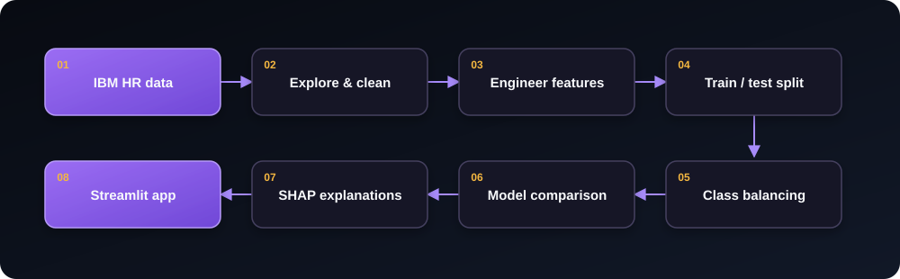
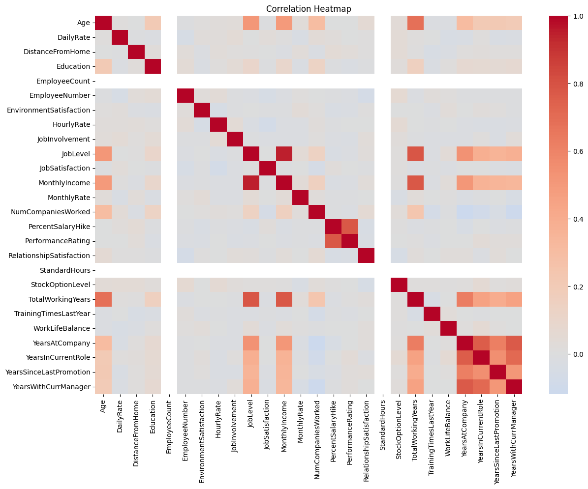
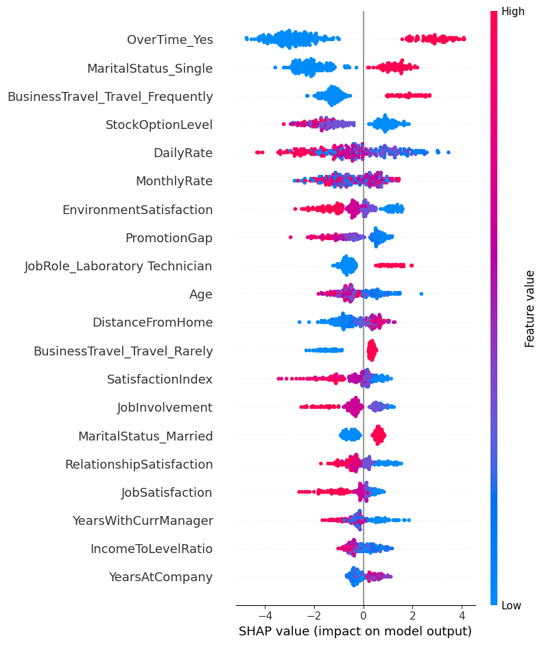

<div align="center">

# Employee Attrition Intelligence

### Explainable workforce-risk analysis with LightGBM, SHAP, and Streamlit

[](https://www.python.org/)
[](https://streamlit.io/)
[](https://lightgbm.readthedocs.io/)
[](https://shap.readthedocs.io/)

A machine-learning project that explores employee attrition, compares sampling and
classification strategies, and provides an interactive risk-estimation interface.

</div>

---

## Overview

Employee attrition is an imbalanced classification problem: relatively few employees
in the dataset left the organization. This project therefore evaluates models with
attrition-class **precision**, **recall**, **F1-score**, and **ROC-AUC**, rather than
relying on accuracy alone.

The project includes:

- Exploratory analysis of workforce, compensation, satisfaction, and tenure features
- Feature engineering for satisfaction, promotion, tenure, and income relationships
- Comparison of Logistic Regression, SVM, and LightGBM
- Evaluation of undersampling, SMOTE, and SMOTEENN strategies
- Global and employee-level explanations using SHAP
- A dark, responsive Streamlit interface for interactive predictions

## Dataset at a glance

| Employees | Original features | Employees who left | Attrition rate |
|:---:|:---:|:---:|:---:|
| 1,470 | 35 | 237 | 16.1% |

The IBM HR Analytics sample contains demographic, role, compensation, satisfaction,
travel, and employment-history attributes. The prediction target is `Attrition`, where
`Yes` indicates that an employee left.

## Analysis workflow



Engineered features include:

- `SatisfactionIndex`: average of job, environment, and work-life satisfaction
- `IncomeToLevelRatio`: monthly income relative to job level
- `PromotionGap`: years at the company minus years since the last promotion
- `TenureRatio`: years at the company relative to total working years

## Exploratory analysis

The correlation view highlights related tenure and seniority variables. Strong
relationships are expected among `JobLevel`, `MonthlyIncome`, `TotalWorkingYears`,
`YearsAtCompany`, and role/manager tenure.



> Correlation describes association, not causation. It should be used to understand
> feature structure and redundancy—not as evidence that one employee characteristic
> causes attrition.

## Model comparison

The following results are recorded in the notebook for the positive class (`Left`) on
the 294-row test set. Values are shown to four decimal places.

| Sampling | Model | Precision | Recall | F1-score | ROC-AUC |
|---|---|---:|---:|---:|---:|
| **SMOTE** | **Logistic Regression** | **0.6053** | **0.4894** | **0.5412** | **0.8163** |
| SMOTEENN | Logistic Regression | 0.5333 | 0.5106 | 0.5217 | 0.8072 |
| SMOTEENN | LightGBM | 0.5000 | 0.4043 | 0.4471 | 0.7829 |
| Undersampling | Logistic Regression | 0.3125 | 0.6383 | 0.4196 | 0.7640 |
| Undersampling | LightGBM | 0.3061 | 0.6383 | 0.4138 | 0.7580 |
| SMOTE | LightGBM | 0.5909 | 0.2766 | 0.3768 | 0.7733 |

The best recorded F1-score and ROC-AUC belong to **Logistic Regression with SMOTE**.
Undersampled models recover more employees who left, but at a substantial precision
cost. The appropriate operating point depends on the cost of false positives versus
missed cases.

## Explainability

SHAP values show how each feature moves model output above or below its baseline.
Each point below represents an employee; horizontal position shows model impact, while
color represents the original feature value.



The notebook identifies overtime, marital status, travel frequency, stock-option
level, rates, satisfaction, promotion gap, and selected role indicators as influential
features. These are model associations and should not be interpreted as causal effects.

## Interactive application

The Streamlit app accepts a focused set of employee inputs:

| Category | Inputs |
|---|---|
| Work pattern | Overtime, work-life balance |
| Experience | Years at company, years since promotion, job level |
| Satisfaction | Job satisfaction, environment satisfaction |
| Compensation | Monthly income |

It returns a risk percentage, a low/moderate/high risk band, and a local contribution
chart. In that chart, **amber** bars raise the predicted risk and **sapphire** bars lower
it.

> [!IMPORTANT]
> This project is an educational decision-support prototype—not an employment decision
> system. Do not use its output to hire, dismiss, promote, compensate, or otherwise
> evaluate an individual. Before any real-world use, validate data quality, subgroup
> fairness, calibration, privacy controls, drift, and applicable employment law. Human
> review and employee context are essential.

> [!WARNING]
> The deployed app loads a LightGBM model refitted on SMOTE-balanced data, while the
> notebook's strongest recorded test result is Logistic Regression + SMOTE. The app also
> collects only eight inputs and fills uncollected model features with zero. Its displayed
> percentage should therefore be treated as a model score—not a calibrated probability.

## Quick start

### 1. Create an environment

```bash
python -m venv .venv
```

Activate it on Windows:

```powershell
.venv\Scripts\Activate.ps1
```

### 2. Install dependencies

```bash
python -m pip install -r requirements.txt
```

### 3. Run the application

```bash
streamlit run app.py
```

Then open the local address printed by Streamlit, normally
`http://localhost:8501`.

## Project structure

```text
.
├── .streamlit/
│  
├── assets/
│   ├── correlation-heatmap.png     # Notebook correlation analysis
│   ├── shap-summary.png            # Global SHAP feature-impact view
│   └── workflow.svg                # Analysis workflow diagram
├── app.py                           # Streamlit prediction interface
├── IBM HR Employee Attrition.ipynb # Analysis, training, and evaluation
├── lgbm_model.pkl                   # Serialized application model
├── model_columns.pkl                # Expected model feature order
├── requirements.txt                 # Application dependencies
└── WA_Fn-UseC_-HR-Employee-Attrition.csv
```

## Next improvements

- Align the deployed estimator with the selected model-comparison result
- Expose or reliably derive every feature expected by the deployed model
- Tune the decision threshold around a documented business objective
- Add probability calibration and calibration-curve reporting
- Report cross-validation confidence intervals and subgroup fairness metrics
- Add schema validation, automated tests, and model/version metadata

---

<div align="center">
Built for transparent experimentation with people analytics and explainable ML.
</div>
